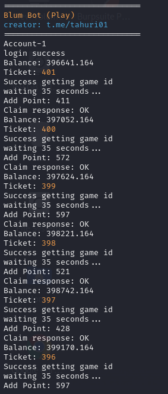

# BLUM BOT (Play Game)




## Instalasi

1. **Clone repository ini:**

    ```bash
    git clone https://github.com/wrightL-dev/PB
    cd PB
2. **Instal package yang diperlukan:**

    ```bash
    npm install axios random-useragent
3. **Tambahin list akun di query.js**

    ```plaintext
   let accounts = [
    // example accounts
     "query1",
     "query2"
    ];
    module.exports = accounts;
4. **Set max/minimum points di config.js**

    ```plaintext
   {
    "maxPoint": 600,
    "minPoint": 200
   }
5. **Perintah jalankan:**

    ```plaintext
   node blum-new.js
## Dukungan

Jika Anda memiliki pertanyaan atau butuh bantuan lebih lanjut, silakan bergabung dengan saluran Telegram kami di [t.me/tahuri01](https://t.me/tahuri01).

## Lisensi

Proyek ini dilisensikan di bawah [MIT License](LICENSE).
